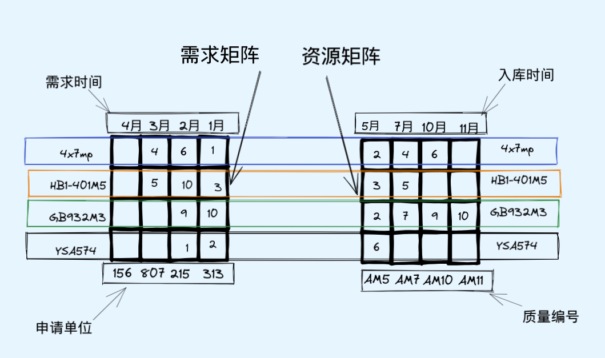

# 本方案主要分为两个部分：业务部分和技术部分。
其中业务部分描述了对业务的一些研究工作，技术部分描述了对技术的一些研究工作。
# 业务部分
在业务部分主要阐述业务分析，算法设计。
## 业务分析
目前锻铸件领料需求量大，而且申请频繁。计划员在批料压力大、批料速度慢。所以希望借助信息化的手段给出资源的最优分配方案。
## 算法设计
### 算法概述
信息系统在后台经过ETL操作之后，是可以看清楚全局的资源情况的，具体表现在可以看清楚全局的需求和全局的资源。因为厂里有多个生产车间、每个生产车间也有多条生产线。而且资源也是这样的情况，同一个资源有多张合格证，可能被存放在不同的地方，造成了资源和需求是多对多的情况，再加之锻铸件还有比较复杂的代料关系。鉴于此，传统的数据分析手段做这件事情会非常乏力，计划员艰难的处境就可想而知了，他们依靠excel这种传统的数据分析工具基本上是很难在比较短的时间推算给出最优的资源分配方案。
然后每个需要都有一个时间戳，而且每一个资源也有它的时间戳。根据需求的时间戳我们可以判断出来需求的紧急程度，根据资源的时间戳我们可以获知资源的入库时间。需求和资源都按照先进先出的原则：即最现申请的资源是最着急的，最先入库的资源要最早出库（避免过期）。我们设计两个二维矩阵，然后根据器材代码消耗过程，就可以反馈出来整个资源的最优分配方案。
### 算法详细草图

### 算法设计伪码
1. 在数据库中做ETL操作，分别抽取出需求数据和资源数据。
2. 需求数据中包含这四个核心信息：器材代码、需求数量、需求时间、申请单位。
3. 资源数据中包含这四个核心信息：器材代码、可用数量、入库时间、合格证编号。
4. 由需求数据中的器材代码和需求时间组成需求矩阵，由资源数据中的器材代码和入库时间组成资源矩阵。
5. 按照器材代码开窗，按照如下的步骤进行需求与资源的衔接匹配：
   -  按照时间的先后顺序，当前的器材代码分别组成需求队列和资源队列。排在最前面的是队长，其中需求队长表示最迫切需要被满足的需求，资源队长表示最迫切出库的资源。
   - 比较队长中的数量大小，记需求队长中的需求数量为 $caption_{need}$，记资源队长中的可用数量为 $caption_{available}$。
   - 拿出来两个队长中较小的那个值，记为 $caption_{min}$ = $min(caption_{need}, caption_{available})$。
   - 将两个队列中的队长数量减去caption_{min}，得到剩余的数量。
   - 数量为0的那个队长出队：如果是需求队长为零，那么就是说这个需求被满足了。如果是资源队长为零，那么就是说这个资源被消耗完了。
   - 一直循环下去，直到需求队列和资源队列有一个为空时，这个资源的对接完成。
   - 如果需求队列为空，就说明这个物料的所有需求被满足了。如果资源队列为空，就说明这个物料的所有资源都被消耗完了。
        > 以草图中的GB932M3这个物料为例，说明资源的分配过程
        > - 需求队长的数量是10，资源队长的数量是2
        > - 最小的数量是2，所以资源队长出队，表示这个资源被消耗完了。同时需求队长的数量减去2，变为8，表示还需要8个才能被满足
        > - 需求队长的数量是8，资源队长的数量是7
        > - 最小的数量是7，所以资源队长出队，表示这个资源被消耗完了。同时需求队长的数量减去7，变为1，表示还需要1个才能被满足
        > - 需求队长的数量是1，资源队长的数量是9
        > - 最小的数量是1，此时需求队长出队，表示这个需求被满足了。同时资源队长的数量减去1，变为8，表示这个资源还需要8个才能被消耗完了
        > - 需求队长数量是9，资源队长数量是8
        > - 最小的数量是8，此时资源队长出队，表示这个资源被消耗完了。同时需求队长的数量减去8，变为1，表示还需要1个才能被满足
        > - 需求队长的数量是1，资源队长的数量是10
        > - 最小的数量是1，此时需求队长出队，表示这个需求被满足了。同时资源队长的数量减去1，变为9
        > - 需求队列为空，GB932M3的资源与需求的对接完毕。
        > - 这个资源匹配的过程，系统会记录下来，并且最后推送给计划员，就是资源的最优分配过程。系统记录的结果是：313申请的10个资源由AM5这张合格证提供2个，AM7这张合格证提供7个,AM10这张合格证提供1个。215申请的9个资源，由AM10这张合格证提供8个，AM11这张合格证提供1个。
- 6. 如果需求矩阵中的器材代码没有循环到最后，则跳回到 `步骤5`，对新的一个物料进行匹配。
- 7. 使用高优先级代料关系，用代料后的器材代码替代用户申请的器材代码，组成新的需求矩阵。跳回到 `步骤4`。
- 8. 使用低优先级代料关系，用代料后的器材代码替代用户申请的器材代码，组成新的需求矩阵。跳回到 `步骤4`。
- 9. 将所有的计算结果推送给计划员的批料页面，让计划员知道最优的资源分配方案。

## 技术部分
### 技术路线选择
如上所属，整个过程的ETL比较简单，没有复杂的多表关联和谓词逻辑运算。整个过程最复杂的是数据对齐、数据转换、数据合并、数据运算等。所以在选择实现方式时没有选择使用SQL语言，而是选择了Python语言。主要有以下几点考量：
- Python有比较好的数据分析工具Jupyter Notebook，目前是业内默认的数据分析工具，用起来比较方便。Jupyter Notebook可以在线编辑脚本，用来可视化修改过程，用来调试比较方便。
- Python是一门灵活的语言，而且有比较好的生态体系，诸如Numpy, Pandas, Matplotlib这些框架在进行数据分析的时候都能起到事半功倍的效果。比较适合用来做数据分析，能够快速的实现一些数据对齐、数据转换、数据合并、数据运算等步骤。
- Python的Flask框架在和用户交互起来非常方便，轻量。可以与用户非常简单便捷的进行交互。
### 部署过程
#### windows下安装anconda环境