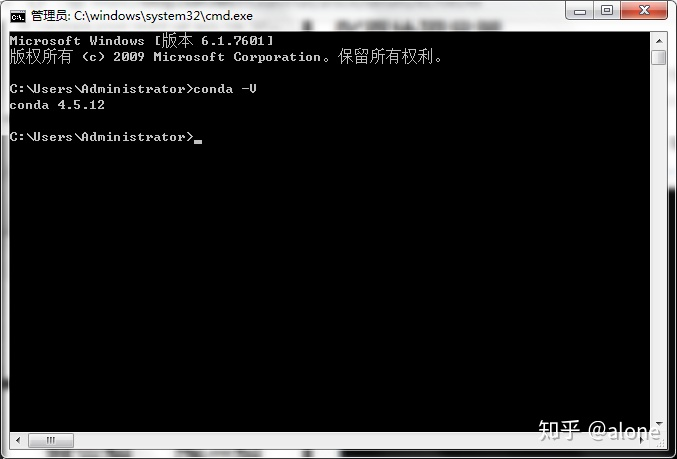

# 本方案主要分为两个部分：业务部分和技术部分。
业务部分描述了对业务的一些研究工作：对业务场景的分析，对业务的一些消化等等。

技术部分描述了对技术的一些研究工作：主要描述了环境的搭建过程，如何将计算机的计算结果推送给用户。
# 业务部分
在业务部分主要阐述业务分析，算法设计。
## 业务分析
业务痛点：目前锻铸件领料需求量大，而且申请频繁。计划员在批料压力大、批料速度慢。

业务单位的优势在于对于自己的业务有着非常清醒的认知，很清楚的知道自己应该怎样干工作能给工厂服务好。劣势在于只见树木，不见森林。而且数据分析工具落后（用的Excel），缺少系统性的数理统计分析思维。

信息化的劣势在于对于业务的认知不够深刻。优势在于能够看清楚全局的数据（需求与资源），有比较强的数据分析工具（SQL, PYTHON, R...），具有系统性的数理统计分析思维支撑自己的工作开展，将系统的复杂性能够控制在自己的能力范围之内。

所以这项工作是业务单位和信息化单位互相配合，取长补短。
## 工作思路
1. 数据准备工作：在数据库经过ETL操作后得到全局的需求数据和资源数据，并抽取出所有的锻铸件借用关系。
2. 算法设计工作：根据用户的业务诉求设计一套算法，能够满足用户的业务需求。
3. 验证优化工作：将算法的计算结果推送给用户，观测用户体验，评测算法的精准程度，能够对算法进行跟进调优。
## 算法设计部分
### 算法详细草图

### 算法设计伪码
1. 在数据库中做ETL操作，分别抽取出需求数据和资源数据。
2. 需求数据中包含这四个核心信息：器材代码、需求数量、需求时间、申请单位。
3. 资源数据中包含这四个核心信息：器材代码、可用数量、入库时间、合格证编号。
4. 由需求数据中的器材代码和需求时间组成需求矩阵，由资源数据中的器材代码和入库时间组成资源矩阵。
5. 按照器材代码开窗，按照如下的步骤进行需求与资源的衔接匹配：
   -  按照时间的先后顺序，当前的器材代码分别组成需求队列和资源队列。排在最前面的是队长，其中需求队长表示最迫切需要被满足的需求，资源队长表示最迫切出库的资源。
   - 比较队长中的数量大小，记需求队长中的需求数量为 $caption_{need}$，记资源队长中的可用数量为 $caption_{available}$。
   - 拿出来两个队长中较小的那个值，记为 $caption_{min}$ = $min(caption_{need}, caption_{available})$。
   - 将两个队列中的队长数量减去caption_{min}，得到剩余的数量。
   - 数量为0的那个队长出队：如果是需求队长为零，那么就是说这个需求被满足了。如果是资源队长为零，那么就是说这个资源被消耗完了。
   - 一直循环下去，直到需求队列和资源队列有一个为空时，这个资源的对接完成。
   - 如果需求队列为空，就说明这个物料的所有需求被满足了。如果资源队列为空，就说明这个物料的所有资源都被消耗完了。
        > 以草图中的GB932M3这个物料为例，说明资源的分配过程
        > - 需求队长的数量是10，资源队长的数量是2
        > - 最小的数量是2，所以资源队长出队，表示这个资源被消耗完了。同时需求队长的数量减去2，变为8，表示还需要8个才能被满足
        > - 需求队长的数量是8，资源队长的数量是7
        > - 最小的数量是7，所以资源队长出队，表示这个资源被消耗完了。同时需求队长的数量减去7，变为1，表示还需要1个才能被满足
        > - 需求队长的数量是1，资源队长的数量是9
        > - 最小的数量是1，此时需求队长出队，表示这个需求被满足了。同时资源队长的数量减去1，变为8，表示这个资源还需要8个才能被消耗完了
        > - 需求队长数量是9，资源队长数量是8
        > - 最小的数量是8，此时资源队长出队，表示这个资源被消耗完了。同时需求队长的数量减去8，变为1，表示还需要1个才能被满足
        > - 需求队长的数量是1，资源队长的数量是10
        > - 最小的数量是1，此时需求队长出队，表示这个需求被满足了。同时资源队长的数量减去1，变为9
        > - 需求队列为空，GB932M3的资源与需求的对接完毕。
        > - 这个资源匹配的过程，系统会记录下来，并且最后推送给计划员，就是资源的最优分配过程。系统记录的结果是：313申请的10个资源由AM5这张合格证提供2个，AM7这张合格证提供7个,AM10这张合格证提供1个。215申请的9个资源，由AM10这张合格证提供8个，AM11这张合格证提供1个。
- 6. 如果需求矩阵中的器材代码没有循环到最后，则跳回到 `步骤5`，对新的一个物料进行匹配。
- 7. 使用高优先级代料关系，用代料后的器材代码替代用户申请的器材代码，组成新的需求矩阵。跳回到 `步骤4`。
- 8. 使用低优先级代料关系，用代料后的器材代码替代用户申请的器材代码，组成新的需求矩阵。跳回到 `步骤4`。
- 9. 将所有的计算结果推送给计划员的批料页面，让计划员知道最优的资源分配方案。
### 算法的Python代码实现

## 技术部分
### 部署过程
#### 安装anaconda
> 安装这个是为了构建python环境，并且提供了一些常用的工具，如pip，jupyter等。后期方便维护python环境。
1. 双击安装文件，启动安装程序:

2. 如果系统只有一个用户选择默认的第一个即可，如果有多个用户而且都要用到 Anaconda ，则选择第二个选项。

3. 建议默认路径安装即可，需要占用空间大约 2.6 G左右。

4. 两个默认就好，第一个是加入环境变量

5. 安装需要一段时间，等待安装完成即可。

6. 输入conda --version显示conda的版本好，就表示安装成功了。

#### 安装相关插件
主要安装两个插件：cx_oracle, flask。第一插件是用来python和oracle数据库通讯的，第二个插件是为了构建web服务，方便用户调用服务器上的python脚本的。

在cx_oracle和flask插件的目录中分别执行 `pip install cx_oralce`, `pip install flask` 即可将两个插件装上。
### 调用服务
#### 服务器上调用
在服务器上直接执行 `python dzj_balance.py` 命令，就可以将在服务器上执行算法，将资源平衡后的结果推送给用户。
#### 客户端调用
